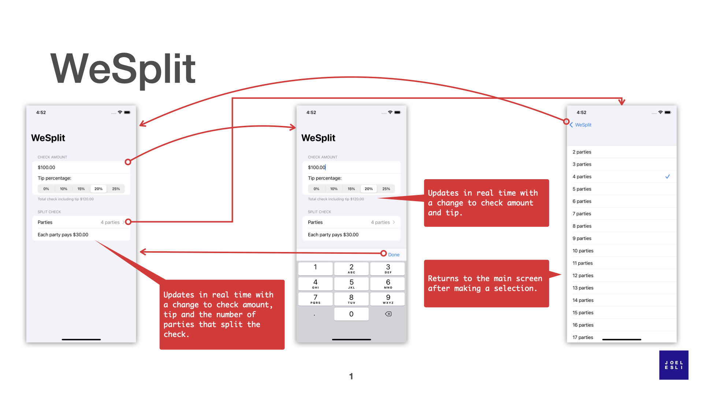
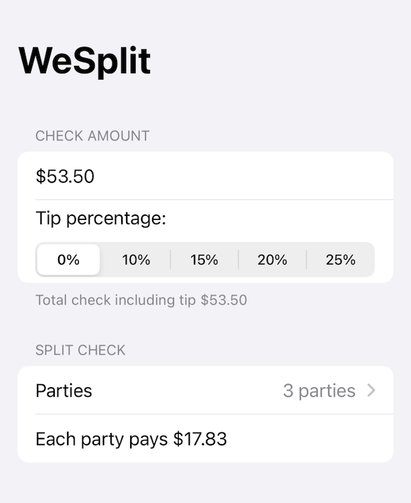

#  WeSplit

This application was built following the SwiftUI tutorial of [Hacking with Swift](https://www.hackingwithswift.com/100/swiftui/), specifically
* [Day 16 – Project 1, part one](https://www.hackingwithswift.com/100/swiftui/16)
* [Day 17 – Project 1, part two](https://www.hackingwithswift.com/100/swiftui/16)
* [Day 18 – Project 1, part three](https://www.hackingwithswift.com/100/swiftui/16)
* [Day 19 – Challenge day](https://www.hackingwithswift.com/100/swiftui/16)

With less than 100 lines of code to build the UI and the business logic, it's impresive what SwiftUI can do. One thing that I am worried about is that, when the app runs, I am getting a few Layout Constraint warnings. 
```
[LayoutConstraints] Unable to simultaneously satisfy constraints.
``` 

## App Flow overview




## TODO: Missing Feature / Remainder 
Splits are not perfect...yet. You might want to split 53.50 EUR between three parties. This won't work, it returns $17.83, which times three is 52.49 EUR in total. To make the app accurate, the data types used need to change, my guess is to Decimal, so watch out for that.
 
 